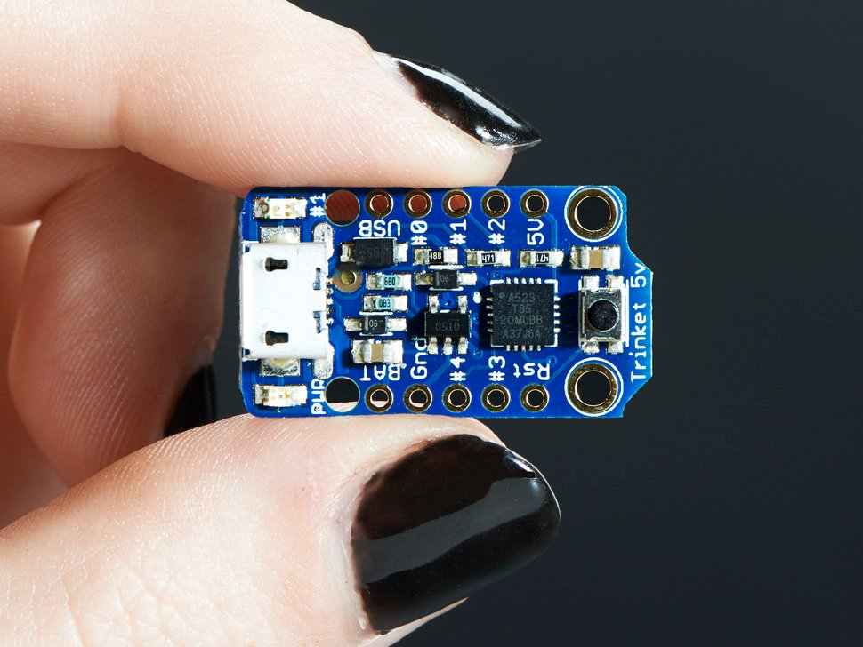

# IOT - Microcontrôleur

## Panorama


Plateforme | Processeur | RAM | Développement | caractéristiques
---------|----------|---------|----------|---------
Adafruit Trinket | ATtiny85 - 16 MHz | 8 Kb | C++ | I/O 5 digital - dont 1 Analog
 Arduino uno | ATmega328P - 16 MHz | 32 Kb | C++ | I/O 14 digital - 6 Analog
 Arduino Nano | ATmega2560 - 16 MHz | 32 Kb | C++ | I/O 22 digital - 8 Analog 
 Arduino Mega 2560 | ATmega328 - 16 MHz | 256 Kb | C++ | I/O 54 digital - 16 Analog 
 Arduino Nano 33 IoT | SAMD21 Cortex-M0 - 48 MHz | 256 Kb | C++ | I/O 14 digital - 8 Analog 
 STM32 Black Pill | STM32 Cortex-M3 - 72 MHz | 64 Kb + 20 Kb | C++ / Micropython | 
 Arduino Portenta H7 | STM32 dual Cortex-M7 - 480 MHz | 8 Mb + 16Mb | C++ / Micropython | I/O WIFI Ethernet tensorflow ...
 Raspberry Pi Pico | RP2040 cortex dual core M0+ - 133 MHz | 2 Mb + 264 Kb | C++ / Micropython | I/O 30 multifonctions
 NodeMCU ESP8266 | Tensilica 32-bit RISC CPU - 80 MHz | 4 Mb + 64 Kb | C++ / Micropython | I/O 16 Digital 1 Analog - Wifi
 HUZZAH32 – ESP32 | dual core Tensilica LX6 - 240 MHz | 4 Mb + 520 Kb | C++ / Micropython | I/O 12 Analog - Wifi - Bluetooth
 M5Stack BASIC | ESP32 dual core - 240 MHz | 16 Mb + 520 Kb | C++ / Micropython | I/O 12 Analog - Wifi - Bluetooth
 Raspberry Pi 4 | Quad-core Cortex-A72 - 1.5 GHz | 4 Gb | C++ / Micropython / Linux | I/O 40 - Wifi - Bluetooth - Ethernet 

## Les cartes MCU

### Adafruit Trinket



* Microcontroller 	ATtiny85
* Digital I/O Pins 	5
* Analog Input Pins 	1
* Flash Memory 	8 Kb 
* SRAM 	512 b
* EEPROM 	512 b
* Clock Speed 	8 MHz
* Dimensions: 31mm x 15.5 x 5mm

### Arduino Uno


* Microcontroller 	ATmega328P
* Digital I/O Pins 	14 (of which 6 provide PWM output)
* Analog Input Pins 	6
* Flash Memory 	32 KB (ATmega328P) of which 0.5 KB used by bootloader
* SRAM 	2 KB (ATmega328P)
* EEPROM 	1 KB (ATmega328P)
* Clock Speed 	16 MHz
* Length 	68.6 mm
* Width 	53.4 mm
* Weight 	25 g

### Arduino Nano


* Microcontroller 	ATmega328
* Architecture 	AVR
* Flash Memory 	32 KB of which 2 KB used by bootloader
* SRAM 	2 KB
* Clock Speed 	16 MHz
* Analog IN Pins 	8
* EEPROM 	1 KB
* Digital I/O Pins 	22 (6 of which are PWM)
* PCB Size 	18 x 45 mm
* Weight 	7 g

### Arduino Mega 2560


* Microcontroller 	ATmega2560
* Digital I/O Pins 	54 (of which 15 provide PWM output)
* Analog Input Pins 	16
* Flash Memory 	256 KB of which 8 KB used by bootloader
* SRAM 	8 KB
* EEPROM 	4 KB
* Clock Speed 	16 MHz
* Length 	101.52 mm
* Width 	53.3 mm
* Weight 	37 g

### Arduino Nano 33 IoT


* Microcontroller 	SAMD21 Cortex®-M0+ 32bit low power ARM MCU
* Radio module 	u-blox NINA-W102 Wi-Fi &  Bluetooth low energy
* Clock Speed	48MHz
* CPU Flash Memory	256KB
* SRAM	32KB
* EEPROM	none
* Digital Input / Output Pins	14
* PWM Pins	11
* UART	1
* SPI	1
* I2C	1
* Analog Input Pins	8 (ADC 8/10/12 bit)
* Analog Output Pins	1 (DAC 10 bit)
* 3D digital accelerometer and a 3D digital gyroscope
* Length	45 mm
* Width	18 mm
* Weight	5 gr (with headers)

### Arduino Portenta H7


* Microcontroller 	STM32H747XI dual Cortex®-M7 (480 MHz) +M4 32bit low power Arm® MCU (240 MHz)
* 8MB SDRAM
* 16MB NOR Flash
* 10/100 Ethernet Phy
* Radio module 	Murata 1DX dual WiFi 802.11b/g/n 65 Mbps and Bluetooth 5.1 BR/EDR/LE
* Supported Battery 	Li-Po Single Cell, 3.7V, 700mAh Minimum (integrated charger)
* Display Connector 	MIPI DSI host & MIPI D-PHY to interface with low-pin count large display
* GPU 	Chrom-ART graphical hardware Accelerator™
* Timers 	22x timers and watchdogs
* UART 	4x ports (2 with flow control)
* Ethernet PHY 	10 / 100 Mbps (through expansion port only)
* SD Card 	Interface for SD Card connector (through expansion port only)
* Camera Interface 	8-bit, up to 80 MHz
* ADC 	3× ADCs with 16-bit max. resolution (up to 36 channels, up to 3.6 MSPS)
* DAC 	2× 12-bit DAC (1 MHz)
* USB-C 	Host / Device, DisplayPort out, High / Full Speed, Power delivery

* Arduino sketches on top of the Arm® Mbed™ OS
* Native Mbed™ applications
* **MicroPython** / JavaScript via an interpreter
* TensorFlow™ Lite

### STM32 Black Pill


* Microcontroller	STM32F103C8T6
* Manufacturer	ST-Microelectronics
* Core	Arm Cortex-M3
* Max. Clock Speed	72MHz
* FLASH	64KiB
* SRAM	20KiB
* Size (w x l)	25mm x 57mm
* Mounting	Breadboard

### MCUDev Black STM32F407VET6


Specifications
* STM32F407VET6 ARM Cortex M4
* 168MHz, 210 DMIPS / 1.25 DMIPS / MHz
* 512 KByte Flash, 192 + 4 KByte SRAM
* 3x SPI, 3x USART, 2x UART, 2x I2S, 3x I2C
* 1x FSMC, 1x SDIO, 2x CAN
* 1x USB 2.0 FS / HS controller (with dedicated DMA)
* 1x USB HS ULPI (for external USB HS PHY)
* Micro SD
* Winbond W25Q16 16Mbit SPI Flash
* RTC battery CR1220
* 1x 10/100 Ethernet MAC
* 1x 8 to 12-bit Parallel Camera interface
* 3x ADC (12-bit / 16-channel)
* 2x DAC (12-bit)
* 12x general timers, 2x advanced timers
* Dimensions: 85.1mm x 72.45mm
* **MicroPython**

### Raspberry Pi Pico


* microcontrôleur RP2040 à cortex double cœur M0+ à 133 MHz.
* flash 2 Mo
* SRAM 264K
* 30 E/S multifonctions à usage général 
* 4 Convertisseur analogique-numérique (ADC) 500 ksps 12 bits
* 2 UART, 2x I2C, 2 SPI, Jusqu’à 16 canaux PWM 1 timer avec 4 alarmes, 1 compteur en temps réel
* 51 x21mm
* **MicroPython**

### NodeMCU ESP8266


Specifications
* Microcontroller: Tensilica 32-bit RISC CPU Xtensa LX106
* Digital I/O Pins (DIO): 16
* Analog Input Pins (ADC): 1
* UARTs: 1
* SPIs: 1
* I2Cs: 1
* Flash Memory: 4 MB
* SRAM: 64 KB
* Clock Speed: 80 MHz
* **MicroPython**

### Adafruit HUZZAH32 – ESP32


* 240 MHz dual core Tensilica LX6 microcontroller with 600 DMIPS
* Integrated 520 KB SRAM
* Integrated 802.11b/g/n HT40 Wi-Fi transceiver, baseband, stack and LWIP
* Integrated dual mode Bluetooth (classic and BLE)
* 4 MByte flash include in the WROOM32 module
* On-board PCB antenna
* Ultra-low noise analog amplifier
* Hall sensor
* 10x capacitive touch interface
* 3 x UARTs 
* 3 x SPI (only one is configured by default in the Feather Arduino IDE support)
* 2 x I2C (only one is configured by default in the Feather Arduino IDE support)
* 12 x ADC input channels
* 2 x I2S Audio
* 2 x DAC
* PWM/timer input/output available on every GPIO pin
* Product Dimensions: 44.0mm x 25.5mm x 4.8mm 
* **MicroPython** et  **CircuitPython**

### M5Stack BASIC


* ESP32 	240MHz dual core, 600 DMIPS, 520KB SRAM, Wi-Fi, dual mode Bluetooth
* Flash Memory 	16MB
* Power Input 	5V @ 500mA
* Port 	TypeC x 1, GROVE(I2C+I/0+UART) x 1
* Core Bottom Port 	PIN (G1，G2，G3，G16, G17, G18, G19, G21, G22, G23, G25, G26, G35, G36)
* IPS Screen 	2 inch, 320x240 Colorful TFT LCD, ILI9342C, max brightness 853nit
* Button 	Custom button x 3
* Speaker 	1W-0928
* Battery 	110mAh @ 3.7V
* Antenna 	2.4G 3D Antenna
* Operating Temperature 	32°F to 104°F ( 0°C to 40°C )
* Net weight 	47.2g
* Product Size 	54 x 54 x 18mm
* Development Platform UIFlow, **MicroPython**, Arduino

Page produit: <https://docs.m5stack.com/#/en/core/basic>

Autres versions:
M5stack GRAY <https://docs.m5stack.com/#/en/core/gray>
* IMU sensor, BMM150 + MPU6886

M5stack FIRE <https://docs.m5stack.com/#/en/core/fire>
* 9-Axis IMU sensor(6-Axis posture acceleration measurement + 3-Axis magnetic measurement)
* 16M Flash + 4M PSRAM

M5stack M5Core2 <https://docs.m5stack.com/#/en/core/core2>
* built-in RTC module
* 6-axis IMU sensor
* 16M Flash + 8M PSRAM

### M5StickC PLUS


* ESP32-based support BLE 4.2 and WiFi
* Built-in 6-Axis IMU
* Red LED
* IR transmitter
* Microphone
* RTC
* Buttons, LCD(1.14 inch)
* Built-in Lipo Battery
* Extendable Socket
* Built-in Passive Buzzer
* Wearable & Wall mounted
* Development Platform UIFlow, MicroPython, Arduino

### Modules M5Stack


* Communication
    * LoRa/LoRaWAN
    * GPS satellite positioning module
    * GSM stackable 2G communication module, LTE
    * NB-IoT wireless communication
    * I2C / CAN / RS485 / TTL Interface
* Driver
    * three-axis stepper motor driver module
    * servo driver module
    * DC MOTOR module
    * FAN Module
* Extension
    * 750mAh High-Capacity Battery
    * universal prototype perboard
    * USB Module
    * M-BUS
    * Hardwired TCP/IP embedded Ethernet / Power Over Ethernet
    * Camera
    * image recognition development board
    * AI Camera / machine vision capabilities
* Faces / Hat
    * FACES Keyboard(GameBoy, Calculator, QWERTY, Calculator)
    * ENCODER Module
    * JOYSTICK
    * finger-print recognition
    * RFID panel
    * THERMAL CAMERA
    * ADC / DAC
    * IR sensor

### Raspberry PI 4


* Processor: Quad-core Cortex-A72 (ARM v8) 64-bit SoC @ 1.5 GHz.
* Digital I/O Pins 	40
* 4 Go de RAM
* Gigabit Ethernet
* USB 2 et USB 3
* Stereo audio
* WIFI 2.4 Ghz / 5 GHz / Bluetooth
* micro HDMI
* SD Card ....
* Linux

### Capteurs interface Grove


Il existe toutes sortes de capteurs.

## MicroPython


MicroPython est une ré-écriture de Python pour les microcontrôleurs (2013).

Plateformes: STM32 / ESP8266 / ESP32 / RISC-V

CircuitPython est un dérivé de MicroPython développé par adafruit <https://circuitpython.org/>

Documentation: <http://docs.micropython.org/en/latest/>

## Documentations
- Site M5stack <https://m5stack.com/>
- Doc ESP-32 <https://m5stack.oss-cn-shenzhen.aliyuncs.com/resource/docs/datasheet/core/esp32_datasheet_en.pdf>
- schéma <https://m5stack.oss-cn-shenzhen.aliyuncs.com/resource/docs/schematic/Core/M5-Core-Schematic(20171206).pdf>
- Chaine youtube <https://www.youtube.com/m5stack>
- Chaine Youtube en français 
    - Premier pas <https://www.youtube.com/watch?v=VBPlcTPtjd4>
    - Gestion des boutons <https://www.youtube.com/watch?v=petJUjiY0bc>
    - MicroPython avec Mu <https://www.youtube.com/watch?v=fLLi0Y_b5Lw>
    - MQTT <https://www.youtube.com/watch?v=C0-vGLvHGyk>
    - API openweathermap.org <https://www.youtube.com/watch?v=CqEPpeGpmkg>
    - rshell - lire/écrire fichiers <https://www.youtube.com/watch?v=eNkw9v2U_Zk>
    - Code source des vidéos <https://github.com/titimoby/M5_experiments>
- Documentation UIFlow <https://m5stack.github.io/UIFlow_doc/en/>    
- Documentation MicroPython sur l'ESP32 <http://docs.micropython.org/en/latest/esp32/quickref.html>
- Manuel utilisateur de UIFlow <https://flow.m5stack.com/download/M5GO_User_Manual_en.pdf>
- Introduction à Grove <http://www.seeedstudio.com/document/pdf/Introduction%20to%20Grove.pdf>

## Environnements de développement
- UIFlow ( Blockly et MicroPython ) <https://flow.m5stack.com/>
- Mu editor (MicroPython) <https://codewith.mu/>
- Arduino IDE ( C/C++ )
- VS Code


## UIFlow Quick Start
<https://docs.m5stack.com/#/en/quick_start/m5core/m5stack_core_get_started_MicroPython>
* Download / Install CP2104 driver
* Download / Install M5burner
* Firmware burning (UIFlow)
* Se connecter à https://flow.m5stack.com/ en utilisant votre API KEY

## Nos capteurs / Extensions

### PORTA-Hub - I2C Hub 1 to 6 Expansion Unit (TCA9548A)
<https://m5stack.com/products/pahub-unit>

### Température
<https://wiki.seeedstudio.com/Grove-Temperature_Sensor_V1.2/#getting-started>

### PIR Motion Sensor (AS312)
<https://m5stack.com/products/pir-module>
```python
from m5stack import *
from m5ui import *
from uiflow import *
import time
import unit

setScreenColor(0x222222)
pir0 = unit.get(unit.PIR, unit.PORTB)

while True:
  if pir0.state:
    setScreenColor(0xff0000)
    wait(1)
  else:
    setScreenColor(0x3333ff)
    wait(1)
```
 
### LED rouge - verte
<https://wiki.seeedstudio.com/Grove-Red_LED/>
<https://www.seeedstudio.com/Grove-Green-LED.html>

### Switch(P)
<https://www.seeedstudio.com/Grove-Switch-P.html>

### Magnetic Switch
<https://www.seeedstudio.com/Grove-Magnetic-Switch.html>

### Grove - Light Sensor v1.2 - LS06-S phototransistor
<https://www.seeedstudio.com/Grove-Light-Sensor-v1-2-LS06-S-phototransistor.html>

### Grove - Sound Sensor/ Noise Detector for Arduino
<https://www.seeedstudio.com/Grove-Loudness-Sensor.html>

### Grove - IR Distance Interrupter v1.2
<https://www.seeedstudio.com/Grove-IR-Distance-Interrupter-v1-2.html>

### Grove - Piezo Buzzer/Active Buzzer 
<https://www.seeedstudio.com/Grove-Buzzer.html>

### Grove - Relay
<https://www.seeedstudio.com/Grove-Relay.html>

